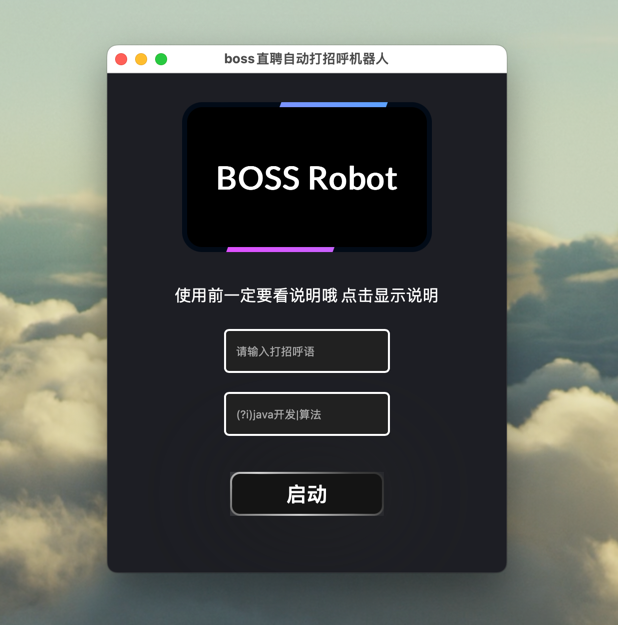

# Boss直聘自动打招呼机器人

## 运行效果图

## [安装包地址](https://github.com/zypotato/go_spider_boss/releases/tag/%E5%AE%89%E8%A3%85%E5%8C%85)

## 使用说明
### **第一步**： 安装浏览器
>需要安装谷歌浏览器 https://www.google.com/intl/zh-CN/chrome/  建议直接安装在默认路径不要改 防止后面路径报错

###  **第二步**： 打开程序输入信息
>筛选关键词支持正则表达式 示范： (?i)java开发|算法工程师， 信息全部输入后直接点击启动按钮即可，浏览器和网址都会自动开启   

**注意⚠️ 程序会在你点击启动按钮60秒后会自动打招呼，以下步骤请尽快完成**

###  **第三步**： 程序启动后会自动开启boss直聘网站（手动关闭其他标签页）
> 登录你的账户，输入你的岗位关键词，选好筛选项地址，岗位要求之类的信息，全部选择好之后进入下一步。（注意把你的自动招呼设置关闭，防止重复打招呼）

###  **第四步**： 页面缩放至25% 如下图

>页面设置结束后等待程序自动运行即可
>
> 
>希望大家早日找到工作 加油！
> 
>
>

