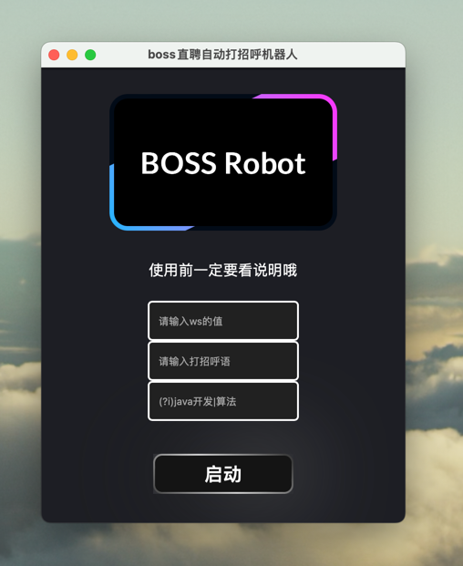
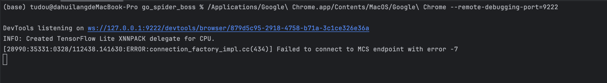
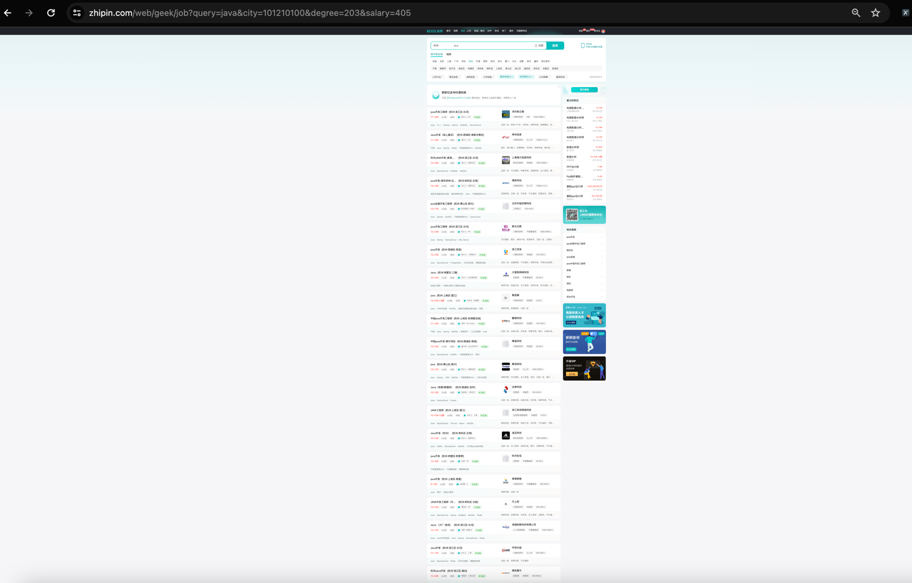

# Boss直聘自动打招呼机器人

## 运行效果图

[](demo_image/img_3.png)
## 使用说明
### **第一步**： 安装浏览器
>需要安装谷歌浏览器 https://www.google.com/intl/zh-CN/chrome/  建议直接安装在默认路径不要改 防止后面路径报错

### **第二步**：打开你的终端
> 
>如果是windows电脑：右击开始菜单，点击运行，输入cmd然后回车即可打开windwos终端
>
>如果是mac电脑：直接按command键和空格  在搜索框输入终端然后回车即可
>
### **第三步**：获取ws值 

如果你是mac电脑，请在终端输入如下命令：  
```bash
/Applications/Google\ Chrome.app/Contents/MacOS/Google\ Chrome --remote-debugging-port=9222
```

如果你是windows电脑，请在终端输入如下命令：
```bash
"C:\Program Files (x86)\Google\Chrome\Application\chrome.exe" --remote-debugging-port=9222
```

### **第四步**：获取ws值
>运行成功后浏览器会自动打开，终端会显示如下信息，蓝色的即是我们需要的ws值
[](demo_image/img_1.png)

### 第五步：打开boss直聘网站
>网址 https://www.zhipin.com/web/geek/job?query=
> 
> 登录你的账户，输入你的岗位关键词，选好筛选项地址，岗位要求之类的信息，全部选择好之后进入下一步。（注意把你的自动招呼设置关闭，防止重复打招呼）
>
### 第六步：页面缩放至25% 如下图
[](demo_image/img_2.png)

### 第七步:打开程序输入信息  
>筛选关键词支持正则表达式 示范： (?i)java开发|算法工程师， 信息全部输入后直接点击启动按钮即可，接下来就看着手机上自动打招呼的记录吧～
>
> 
> ❗️注意：ws值填错会导致程序闪退  建议填写前确认好
> 
>希望大家早日找到工作 加油！
> 
>
> 
> wails build -platform windows/amd64